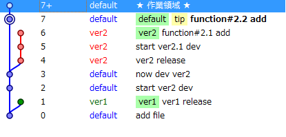
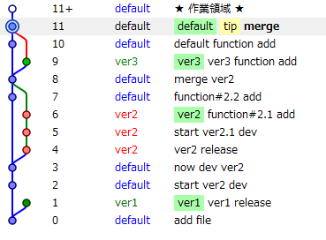

hg Release Branch
=================

今作ってるアプリをリリースしようと思ったが、実は未だにブランチを作成したことすらないのでブランチについてまじめに考えてみようと思う。

Let's Branch
------------

とりあえず、ブランチを作ってみた。

画像はTortoiseHgのWorkbench。

::

    # hg branch hoge
    # hg ccmmit -m "to hoge"
    # hg update default
    # hg commit -m "to default"

適当に作っているので、細かいところは気にしない。

作るのは簡単だが、ブランチ作成とは何に使うのか？というところがわからないのでバージョン管理におけるブランチの意味について考えてみる。

Branch
------

どんな時にブランチができるのか

* リリース
* 他の人にcloneされる
* etc

1つ目はいつはmasterにマージされる。

2つ目は、pull reauestをすればきっとマージしてくれる。

なんにせよ結局ブランチはマージされる運命にある。

その他にも必要に応じてブランチを作る状況があるかもしれない。知った段階で追記したい。

Release Branch
--------------

本題のリリースブランチ。

# リリースブランチのあり方

1. ひと通り実装が終わったらリリースブランチを作成(テストはその後)
2. テストやバグ修正のコミットはリリースブランチに
3. テスト、バグ修正が終了->defaultにマージ
4. リリースブランチの先頭にTagをつける

このようなワークフローが一般的なようだ。

GithubやBitbucketにあるリポジトリのコミットログを見たりして勉強するのが一番いいのかもしれない。
(ちらっと見てみた限りだとこんなようなワークフローが多い気が)

* この記事を参考 `Gitにおけるリリースブランチのつかいかた | EIPラボ <http://www.eiplab.com/2011/06/git-release-branch/>`_
* ちなみにこの記事は"入門git - オーム社"を参考にしてある

hgでは以下のようにtagをつける。

::

    # hg tag hoge

Function Branch
---------------

開発中からブランチを切っていくという発想もある。

新しい機能を実装しようという時にmasterから、その機能実装用にブランチを切ってそこでその機能を作成する。

機能ブランチについてメリット・デメリットを考えてみた。

# merit

* masterが綺麗なまま保たれる(いつでもリリース可能)
* ブランチがマイルストーン的な役割を果たしてくれる
* その機能を追加した時の作業分が明確にわかる

# demerit

* 機能実装中に他の機能実装依頼があった時困りそう
* ブランチを作ることに慣れていない人はめんどい
 
  * 今どのブランチにいるとか気にしたことすらないのでどこにコミットしているのかわかんなくなるかもしれない

# 使う場面

他人のプロジェクトをForkした際に、pull requestを送るとき。

1. Forkした段階でbranchを切る。
2. 何らかの修正をする
3. この機能取り入れてほしいな。と思う。
4. pull requestを送る
5. branchを切ってあると、どこまで修正してあるのかわかりやすい
6. branchを取り込めば、pull requestを送った人の環境で簡単にテスト可能
7. 気に入ったら、branchをマージするだけでいい

マナー的にpull requestをするときはbranchを切ったほうが良好な人間関係が作れる気がする。

Merge
-----

ブランチといえばマージがついてくる。Conflictがあった時にマージしないといけない。

デフォルトのマージはかなり残念なコトになっているので

::

    <<<<<<<<<local
    default
    ==========
    ver other
    >>>>>>>>>other

これをいちいちエディタで修正するのは無駄。

Vimmerはhgrcに以下を設定しよう。

::

    [ui]
    merge = vimdiff

vimdiffでは画面が以下のように分割して出現する。

::

    マージ結果 | local | other

マージもしてみた感じはこんなん。

私事だが、最近vim .hg/hgrcとして設定をちまちまいじっていたが、~/.hgrcに書けばメシウマということに気づいた。

参考記事
--------

# ブランチにもっと詳しくなりたい時

以下の記事を見てみるといいかもしれない

* `MercurialとGitのブランチの違い - wyukawa’s blog <http://d.hatena.ne.jp/wyukawa/20101205/1291549247>`_

.. author:: default
.. categories:: none
.. tags:: hg
.. comments::
