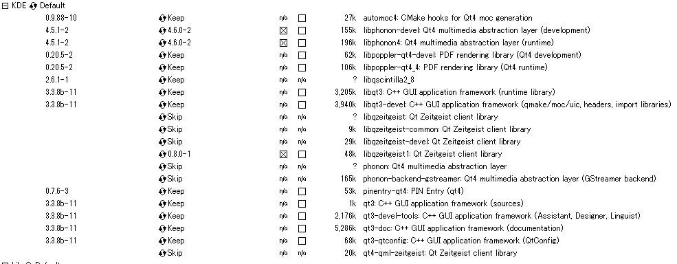

PyQt4 install for Cygwin
========================
きっとCygwinユーザーがCygwinでmakeするのはもう嫌と感じるのはもう運命だと思う。

というわけで、PyQt4は欲しくなったのでインストールする。

欲しくなった原因はMkdPreview.vim。

先に書いておくが、全部自前makeしないといけない。

1. Qt4入ってる？
----------------
.. code-block:: bash

 $ ls /usr/lib | grep qt

qt4があれば入ってる。自分は入ってた。フルインストールしたら多分入ってるっぽい。

2. sip
------
PyQt4を入れる前に、sipなるものを入れる必要がある。

`Riverbank | Software | SIP | What is SIP? <http://www.riverbankcomputing.co.uk/software/sip/intro>`_

読んでみると、C/C++のライブラリ、ここではQtとPythonのバインディングをするツールであることがわかる。

tarファイルをダウンロード(`Riverbank | Software | SIP | SIP Download <http://www.riverbankcomputing.co.uk/software/sip/download>`_)してmakeする。

.. code-block:: bash

  $ tar -zxvf sip-4.14.6.tar.bz
  $ cd sip-4.14.6
  $ python configure.py
  $ make
  $ make install

意外とすんなり。

3. PyQt4
--------
後は、PyQt4をダウンロードしてmakeするだけ。

`Riverbank | Software | PyQt | PyQt4 Download <http://www.riverbankcomputing.co.uk/software/pyqt/download>`_

Linux, UNIX sourceを選択。

その前に、qmakeのパスが通っているか確認。通ってなければPATHに追加。

.. code-block:: bash

  $ qmake
  command not found.
  $ vim ~/.zshrc
  PATH=(自分の設定):$PATH:/usr/lib/qt4/bin 
  $ source ~/.zshrc

使ってるシェルは人によって違う。自分はzsh。

.. code-block:: bash

  $ tar -zxvf PyQt-x11-gpl-4.10.1.tar.gz
  $ cd PyQt-x11-gpl-4.10.1
  $ python configure.py -g
  $ make
  $ make install

ここでの注意点は２つあって

1. | python configure.py に-gオプションをつける。
   | オプションなして実行すると-gか-kのどちらかつけろといわれるので、-gをつける。
2. めっっっっっっっっっちゃ時間かかる。ちょっと焦るくらい終わらないので、時間のあるときにやる。

というわけで１時間後。

.. code-block:: bash

  recipe for target `_qt.dll' failed

ん？

.. code-block:: bash

  recipe for target `_qt.dll' failed

ん？

見たくない現実が。１時間返せ。返してくれCygwin。

-g / -kオプションを適当に選択してしまったのが悪いっぽい。と言うかなんだこのオプション。

-g / -k -> なんかGNOMEかKDEっぽいな。(調べてないので本当にどうかは知りません)

CygwinのQtってGNOME？KDE？setup.exeを見てみよう。

QtはKDEの中にしかありません。

オプションを-kにして再度チャレンジ。

小一時間後うまいことmakeできたのでmake install。

4. import PyQt4
---------------
.. code-block:: bash

  $ python
  >>> import PyQt4
  >>>

キマシタワー。

5. Cygwin以外 & 雑記
--------------------
Ubuntuではapt-getでインストール出来るみたい。

`Wind And Tide: PyQt4をubuntuにインストールする <http://squalo22-diary.blogspot.jp/2011/09/pyqt4ubuntu.html>`_

pip search pyqtしたところPyPiにあるみたいだった。。。

まさかとは思うが、自前makeしなくても良かったの。。。ってなった。今度試してみよう。

PySideをpipでインストールしようとしたらhogehogeという記事があったので何かしら参考になるかもしれない。

`Pythonbrew環境下にPySideをインストールしようとしたらはまった - kk6のメモ帳* <http://kk6.hateblo.jp/entry/20110815/1313405197>`_

個人的に使うならPySide使ってみたかったから今度やってみよう。

.. author:: default
.. categories:: none
.. tags:: python, Qt
.. comments::
