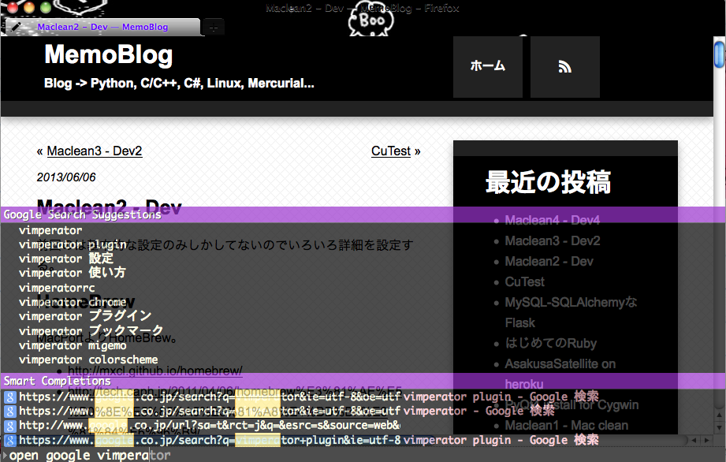
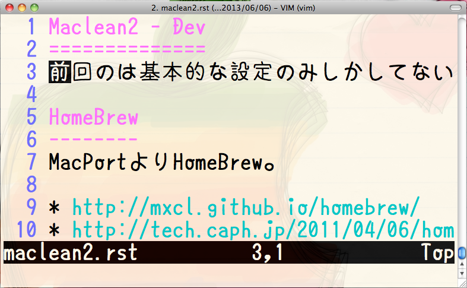

Maclean2 - Dev
==============
前回のは基本的な設定のみしかしてないのでいろいろ詳細を設定する。

HomeBrew
--------
MacPortよりHomeBrew。

* http://mxcl.github.io/homebrew/
* http://tech.caph.jp/2011/04/06/homebrew%E3%81%AE%E5%B0%8E%E5%85%A5%E3%81%A8%E4%BD%BF%E3%81%84%E6%96%B9/

.. code-block:: bash

  $ ruby -e "$(curl -fsSL https://raw.github.com/mxcl/homebrew/go)"
  $ brew install git
  $ brew doctor
  $ brew update

開発系なパッケージ管理はHomeBrewからやろう。

Growl
-----
`Growl <http://growl.info/>`_

Mac用のポップアップ通知システム。

1.3から有料になってしまっている。

1.2なら無料。`growl - A notification system for Mac OS X. - Google Project Hosting <https://code.google.com/p/growl/>`_

というわけで1.2.2をインストール。

最新版との違いは調べていないので分からないが、なんか不具合があってから調べるで問題ないかな。

コードをhgで落としてビルドするという荒業を使えば1.3以降のバージョン(最新版)も使えるみたい。

* `Growl 1.3を無料でインストールする - by shigemk2 <http://d.hatena.ne.jp/shigemk2/20111125/1322210387>`_
* `有料になってしまったGrowl 1.3を無料でインストールする方法 - Macの手書き説明書 <http://veadardiary.blog29.fc2.com/blog-entry-3609.html>`_

Lionからは標準の通知システムが有るらしい。いいな。

Firefox
-------
プラグイン

* vimperator
* lastpass
* firebug
* mybookmarks

アドオンで検索すれば全部見つかるのでインストールからの再起動。

テーマはこれ。

`Monokuro Boo Pigs :: Add-ons for Firefox <https://addons.mozilla.org/ja/firefox/addon/monokuro-boo-pigs/>`_

モノクロのブタさんを愛用。

vimperator
^^^^^^^^^^
Vimmerの必需品。もう普通のFirefoxには戻れない。

`vimperator setting file <https://gist.github.com/yymm/3000407>`_

~/.vimperatorrcに配置。

カラースキーム、プラグインのフォルダ配置。

プラグインはリポジトリから落として、必要に応じてコピーする。

`vimpr/vimperator-plugins · GitHub <https://github.com/vimpr/vimperator-plugins>`_

.. code-block:: bash

  $ cd ~/.vimperator
  $ git clone https://github.com/vimpr/vimperator-plugins

とりあえずこれだけ入れる。

* _libly.js
* _smooziee.js
* `vimperator_copy.js <https://gist.github.com/yymm/f36d681650015cd216c0>`_

Firefox20からjsまわりが変更になってるのでちょくちょくプラグイン更新したほうがいいかも。

カラースキームはGistに。

`yymm_sweets.vimp <https://gist.github.com/yymm/5689022>`_

フォルダ構成はこうなる。

.. code-block:: bash

  > .vimperator
    > colors
    > info
    > plugin
    > vimperator-plugins

結果こんなFirefoxになる。

ゆたぽん
--------
`font　ゆたぽん（コーディング）　フォント <http://net2.system.to/pc/font.html>`_

フォントがゆたぽんじゃないと体調が悪くなってくるので早く入れないと。

Macに.ttc投げてもダメっぽいので(試してないけど)、otfに変換してインストールする。

otfのゆたぽんをシェアウェアとしてリリースしてあった。ただじゃないと嫌なので頑張る。(ベータ版はタダ)

`Macにフォント「ゆたぽん（コーディング）」をインストールしてみた。 - Life is Over <http://d.hatena.ne.jp/kitchan_jp/20110418/1303140241>`_

このエントリで紹介している方法は以下の感じ

1. Windowsにゆたぽんをダウンロード
2. UniteTTCなるアプリでttfに分離
3. OTEditなるアプリ(無料は30日間)でttfをotfに変換 -> よくわからなかったらここ `TrueTypeフォントからOpenTypeフォントへの変換方法 <http://opentype.jp/ttf2otf.htm>`_
4. Macにotfを移動して、otfファイルをダブルクリックでFontBookに追加
5. iTerm2のPreferencesでフォントをゆたぽんに

.. author:: default
.. categories:: none
.. tags:: mac
.. comments::
