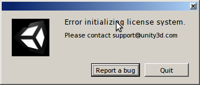

UbuntuでUnityを使えるようになるまで with Wine
=============================================

UbuntuでUnity(ゲームのほう)を動かすのに嵌ったのでメモ(主にWineで)

Wineで嵌りどころが多いのは今日に始まったことではないので、めげずに頑張りました。

**バージョン情報**

* Ubuntu 13.10 (Desktop)
* Unity 4.3.4

嵌まりポイントと共にインストール手順を。

新しいWineを使う
----------------

**apt-get install wineで入るwineではdotnet20のインストールの時点でコケます。**

Ubuntu13.10のapt-get install wineで入るwineは1.4(たしか)。

新しいUnity(4.3とか)を入れたい場合はwine1.7が必要。( `wine - Can't install dotnet - Ask Ubuntu <http://askubuntu.com/questions/262960/cant-install-dotnet>`_ )

`wine - Can't install dotnet - Ask Ubuntu <http://askubuntu.com/questions/262960/cant-install-dotnet>`_

上記のURLにしたがって1.7をインストール。

.. code-block:: bash

  $ sudo apt-get remove wine
  $ sudo add-apt-repository ppa:ubuntu-wine/ppa
  $ sudo apt-get update && sudo apt-get install wine1.7

Unityは32bit版で使う
--------------------

シェルの設定ファイル(bashrc, zshrcなど)に32bit設定の変数を書いておく。

.. code-block:: bash

  // WINEPREFIXは任意パス(自分はwine32にしている)
  export WINEPREFIX=$HOME/wine32
  export WINEARCH=win32

その後、winecfgコマンドを使うと、コンフィグ画面表示前にWINEPREFIXの場所にもろもろのファイルが生成される。

Unityに必要なパッケージをwinetricksを使ってインストール
-------------------------------------------------------

guiでやりたい場合は以下のコマンドで開くGUIからインストールする。

.. code-block:: bash

  winetricks --gui

Wineの公式に必要なパッケージについて記載があるので参考にする。

`WineHQ - Unity 4.3.2 <http://appdb.winehq.org/objectManager.php?sClass=version&iId=29671>`_

`WineHQ - Unity 4.1.2 <https://appdb.winehq.org/objectManager.php?sClass=version&iId=28175>`_

winetricksでインストール。

.. code-block:: bash

  $ winetricks tahoma
  $ winetricks d3dx9
  $ winetricks dotnet20
  $ winetricks corefonts
  ($ winetricks dotnet40)
  ($ winetricks forcemono)

()はoptional。

Unity(Windows版)インストーラーをダウンロードしてインストール
------------------------------------------------------------

`Unity - ダウンロード <http://japan.unity3d.com/unity/download/>`_

ここからダウンロードしてwineでインストール。

.. code-block:: bash

  $ cd <ダウンロード先>
  $ wine Unity****.exe

インストールするとデスクトップにアイコンができる。

起動するとエラー
----------------

このエラーでググると、この動画( `How to install Unity3D 4 on Linux - YouTube <https://www.youtube.com/watch?v=Q6YzEfHc81k>`_ )を見て解決している人がいた。

なにやらレジストリに'ProductID'というファイル(?)があります。(初期状態では存在しない)

追加してみます。

#. $ winetricks --gui
#. 'Select the default wineprefix'を選択
#. 'Run regedit'を選択
#. 右側のツリーで'HKEY_LOCAL_MASHINE>Software>Microsoft>Windows NT>CurrentVersion'を選択
#. ここで右クリック、メニューの'新規>文字列値'を選択
#. 名前を'ProductID'に変更

そうするとUnityが起動するようになりました。

新規プロジェクトがパスが不正だとかで作れない
--------------------------------------------

一番はじめに出てくる新規作成画面で作成しようとすると、'specified path is valid unity'とエラーが発生します。

何故かどうやっても作成できません。

以下のリンクのDiscussionでは、

`Unity: Downloading and Installing | Unity Cookie <http://cgcookie.com/unity/2011/11/30/unity-3d-downloading-and-installing/>`_

.. note::

  Hi, I’ve installed unity in wine as I am a linux user. When I make a new project I make a folder for it but I get an error: Specified path is not valid(should be a name of an nonexisting or empty directory)
  
  Is this wine being unreliable or is there something wrong with what I am doing?
  
  > Hi there- that’s a good question, I may just have to try it myself. It would be great to have Unity usable in Linux!
  
  > For now, I would try a few trial-and-error fixes…first create the directory, then the project, create the directory via the “new project” dialogue, etc. It probably just Wine being a little finicky.
  
  >> sorry, I should clarify what I said, I get the error when I make the directory in the new project dialogue. When I make it outside of the dialogue box I can’t create the project. :(

諦めて、既存のプロジェクトをWindowsのUnityからコピーしてきて起動しましょう。

既存のプロジェクト起動
----------------------

やっと起動しました。

その後の嵌まりポイントがあるのかは未だ知りませんがUbuntu-WineでもUnityいけるようです。

"ubuntu unity"でググったときは、UIのほうばかり出てきてgameのほうを探してるときはかなりウザいですね。

他のバージョンでは試してませんが、現在の最新バージョン(多分)での検証でした。

.. author:: default
.. categories:: none
.. tags:: Ubuntu, Unity
.. comments::
